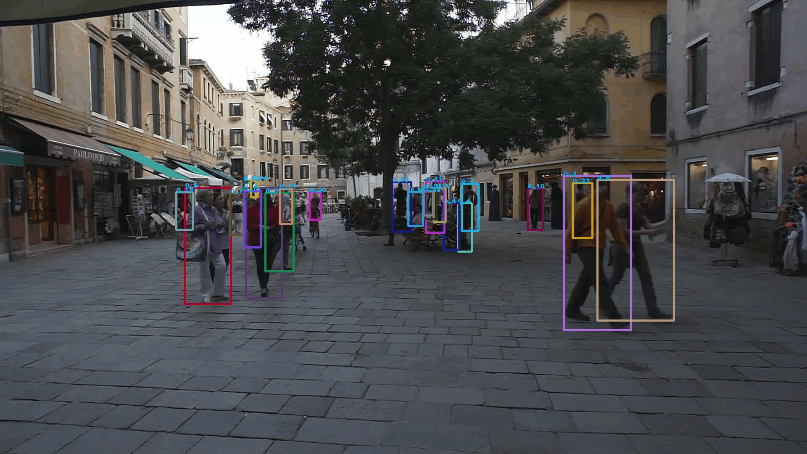

# YOLO detector and SOTA Multi-object tracker Toolbox

## ❗❗Important Notes

There has been a major update recently, and I **re-organized** all the codes for accuracy and readability. More importantly, **two new sota trackers are added** (ImproAssoc and TrackTrack), and **TensorRT** engine is supported!

The new version is on **branch v2.1**:

```bash 
git clone https://github.com/JackWoo0831/Yolov7-tracker.git
git checkout v2.1  # change to v2.1 branch !!
```

🙌 ***The QQ Group is established and welcome to join!*** You can raise bugs, suggestions, or work together on interesting CV/AI projects in the QQ group!
However, bugs or issues should still be prioritized in the **Issue section in Github** for others to see.


<div align="center">

**Language**: English | [简体中文](README_CN.md)

</div>

## 🗺️ Latest News

- ***2025.11.28*** FastTracker is added. Fix lost tracklets bugs of CBIoU_tracker.
- ***2025.7.8*** New version 2.1 released. Add ImproAssoc, TrackTrack and support TensorRT. The other details are as follows:

<details>
<summary>Update details</summary>


1. Re annotate and organize all functions in `matching.py`
2. For camera motion compensation, custom feature extraction algorithms (SIFT, ORB, ECC) can be used, and the `--cmc_method parameter` can be specified when running `track.py` (or `track_demo.py`).
3. For methods such as BoT SORT and ByteTrack, the original low confidence screening threshold is fixed at 0.1 You can now manually set the `--conf_thresh_low` parameter when running `track.py`.
4. Add the `init_thresh` parameter as the initialization target threshold, abandoning the original `args.conf + 0.1` setting. Specify the `--init_thresh` parameter when running `track.py`.
5. In ReID feature extraction, the original crop size was a fixed value of `(h, w) = (128, 64)`, which can now be manually set. When running `track.py`, specify the `--reid_crop_size` parameter, for example, `--reid_crop_size 32 64`.
6. Inherit all Trackers from the BaseTracker class to achieve good code reuse
7. Fix the reid similarity calculation bug in Strongsort
8. Abandon cython.bbox for better compatibility with numpy versions
9. Abandon np.float, etc. for better compatibility with numpy versions
10. Reorganize requirements.txt
</details>


## ❤️ Introduction

This repo is a toolbox that implements the **tracking-by-detection paradigm multi-object tracker**. The detector supports:

- YOLOX 
- YOLO v7
- YOLO v3 ~ v12 by [ultralytics](https://docs.ultralytics.com/), 

and the tracker supports:

- SORT
- DeepSORT 
- ByteTrack ([ECCV2022](https://arxiv.org/pdf/2110.06864)) and ByetTrack-ReID
- Bot-SORT ([arxiv2206](https://arxiv.org/pdf/2206.14651.pdf)) and Bot-SORT-ReID
- OCSORT ([CVPR2023](https://openaccess.thecvf.com/content/CVPR2023/papers/Cao_Observation-Centric_SORT_Rethinking_SORT_for_Robust_Multi-Object_Tracking_CVPR_2023_paper.pdf))
- DeepOCSORT ([ICIP2023](https://arxiv.org/abs/2302.11813))
- C_BIoU Track ([arxiv2211](https://arxiv.org/pdf/2211.14317v2.pdf))
- Strong SORT ([IEEE TMM 2023](https://arxiv.org/pdf/2202.13514))
- Sparse Track ([arxiv 2306](https://arxiv.org/pdf/2306.05238))
- UCMC Track ([AAAI 2024](http://arxiv.org/abs/2312.08952))
- Hybrid SORT ([AAAI 2024](https://ojs.aaai.org/index.php/AAAI/article/view/28471))
- ImproAssoc ([CVPRW 2023](https://openaccess.thecvf.com/content/CVPR2023W/E2EAD/papers/Stadler_An_Improved_Association_Pipeline_for_Multi-Person_Tracking_CVPRW_2023_paper.pdf))
- TrackTrack ([CVPR 2025](https://openaccess.thecvf.com/content/CVPR2025/html/Shim_Focusing_on_Tracks_for_Online_Multi-Object_Tracking_CVPR_2025_paper.html))
- FastTracker ([arxiv 2508](https://arxiv.org/pdf/2508.14370))

and the reid model supports:

Pedestrain Re-ID:
- OSNet
- Extractor from DeepSort
- ShuffleNet
- MobileNet

Vehicle Re-ID:
- VehicleNet ([AICIty-reID-2020](https://github.com/layumi/AICIty-reID-2020))

> **checkpoitns of some Re-ID models**: [Baidu Disk](https://pan.baidu.com/s/1QbVoBz4mPpf4Qsqq1PYXkQ) Code: c655


The highlights are:
- Supporting more trackers than MMTracking
- Rewrite multiple trackers with a ***unified code style***, without the need to configure multiple environments for each tracker 
- Modular design, which ***decouples*** the detector, tracker, reid model and Kalman filter for easy conducting experiments




##  🔨 Installation

The basic env is:
- Ubuntu 20.04
- Python：3.9, Pytorch: 1.12

Run following commond to install other packages:

```bash
pip3 install -r requirements.txt
```

### 🔍 Detector installation

1. YOLOX:

The version of YOLOX is **0.1.0 (same as ByteTrack)**. To install it, you can clone the ByteTrack repo somewhere, and run:

``` bash
https://github.com/ifzhang/ByteTrack.git

python3 setup.py develop
```

2. YOLO v7:

There is no need to execute addtional steps as the repo itself is based on YOLOv7.

3. YOLO series by ultralytics:

Please run:

```bash
pip3 install ultralytics
or 
pip3 install --upgrade ultralytics
```

### 📑 Data preparation

***If you do not want to test on the specific dataset, instead, you only want to run demos, please skip this section.***

***No matter what dataset you want to test, please organize it in the following way (YOLO style):***

```
dataset_name
     |---images
           |---train
                 |---sequence_name1
                             |---000001.jpg
                             |---000002.jpg ...
           |---val ...
           |---test ...

     |

```

You can refer to the codes in `./tools` to see how to organize the datasets.

***Then, you need to prepare a `yaml` file to indicate the path so that the code can find the images.***

Some examples are in `tracker/config_files`. The important keys are:

```
DATASET_ROOT: '/data/xxxx/datasets/MOT17'  # your dataset root
SPLIT: test  # train, test or val
CATEGORY_NAMES:  # same in YOLO training
  - 'pedestrian'

CATEGORY_DICT:
  0: 'pedestrian'
```


## 🚗 Practice 

### 🏃 Training 

Trackers generally do not require parameters to be trained. Please refer to the training methods of different detectors to train YOLOs.

Some references may help you:

- YOLOX: `tracker/yolox_utils/train_yolox.py`

- YOLO v7:

```shell
python train_aux.py --dataset visdrone --workers 8 --device <$GPU_id$> --batch-size 16 --data data/visdrone_all.yaml --img 1280 1280 --cfg cfg/training/yolov7-w6.yaml --weights <$YOLO v7 pretrained model path$> --name yolov7-w6-custom --hyp data/hyp.scratch.custom.yaml
```  

- YOLO series (YOLO v3 ~ v12) by ultralytics:: `tracker/yolo_ultralytics_utils/train_yolo_ultralytics.py`

```shell
python tracker/yolo_ultralytics_utils/train_yolo_ultralytics.py --model_weight weights/yolo11m.pt --data_cfg tracker/yolo_ultralytics_utils/data_cfgs/visdrone_det.yaml --epochs 30 --batch_size 8 --img_sz 1280 --device 0
```

> The training of Re-ID model please refer to its original paper or github repo. The pedestrain Re-ID model such as ShuffleNet, OSNet please refer to [torchreid](https://github.com/KaiyangZhou/deep-person-reid), the vehicle Re-ID model please refer to [AICIty-reID-2020](https://github.com/layumi/AICIty-reID-2020).

### 😊 Tracking ! 

**If you only want to run a demo**:

```bash
python tracker/track_demo.py --obj ${video path or images folder path} --detector ${yolox, yolov7 or yolo_ultra} --tracker ${tracker name} --kalman_format ${kalman format, sort, byte, ...} --detector_model_path ${detector weight path} --save_images
```

> ❗❗Important Notes
> 
> If you want to use the detector trained by **ultralytics**, the `--detector` argument **must include** the substring `ultra`, such as 
> `--detector yolo_ultra`, `--detector yolo_ultra_v8`, `--detector yolov11_ultra`, `--detector yolo12_ultralytics`, etc.

For example:

```bash
python tracker/track_demo.py --obj M0203.mp4 --detector yolo_ultra_v8 --tracker deepsort --kalman_format byte --detector_model_path weights/yolov8l_UAVDT_60epochs_20230509.pt --save_images
```

or

```bash
python tracker/track_demo.py --obj /root/datasets/visdrone/images/val/seq/ --detector yolox --tracker bytetrack --kalman_format byte --detector_model_path weights/yolox_m_VisDrone_55epochs_20230509.pth.tar --yolox_exp_file ./tracker/yolox_utils/yolox_m.py --save_images
```

**If you want to run trackers on dataset**:

```bash
python tracker/track.py --dataset ${dataset name, related with the yaml file} --detector ${yolox, yolo_ultra_v8 or yolov7} --tracker ${tracker name} --kalman_format ${kalman format, sort, byte, ...} --detector_model_path ${detector weight path}
```

In addition, you can also specify

`--reid`: Enable the reid model (currently useful for ByteTrack, BoT-SORT, OCSORT)

`--reid_model`: Which model to use: Refer to `REID_MODEL_DICT` in `tracker/trackers/reid_models/engine.py` to select

`--reid_model_path`: Loaded re-identification model weight path

`--conf_thresh_low`: For two-stage association models (ByteTrack, BoT-SORT, etc.), the minimum confidence threshold (default 0.1)

`--fuse_detection_score`: If added, the IoU value and the detection confidence value are fused, for example, the source code of BoT-SORT does this

`--save_images`: Save the result image

***Examples of tracking algorithms***:

- SORT: `python tracker/track.py --dataset uavdt --detector yolo_ultra_v8 --tracker sort --kalman_format sort --detector_model_path weights/yolov8l_UAVDT_60epochs_20230509.pt `

- DeepSORT: `python tracker/track.py --dataset visdrone_part --detector yolov7 --tracker deepsort --kalman_format byte --detector_model_path weights/yolov8l_VisDroneDet_35epochs_20230605.pt`

- ByteTrack: `python tracker/track.py --dataset uavdt --detector yolo_ultra_v8 --tracker bytetrack --kalman_format byte --detector_model_path weights/yolov8l_UAVDT_60epochs_20230509.pt`

- OCSort: `python tracker/track.py --dataset mot17 --detector yolox --tracker ocsort --kalman_format ocsort --detector_model_path weights/bytetrack_m_mot17.pth.tar`

- C-BIoU Track: `python tracker/track.py --dataset uavdt --detector yolo_ultra_v8 --tracker c_bioutrack --kalman_format bot --detector_model_path weights/yolov8l_UAVDT_60epochs_20230509.pt`

- BoT-SORT: `python tracker/track.py --dataset uavdt --detector yolox --tracker botsort --kalman_format bot --detector_model_path weights/yolox_m_uavdt_50epochs.pth.tar`

- Strong SORT: `python tracker/track.py --dataset visdrone_part --detector yolo_ultra_v8 --tracker strongsort --kalman_format strongsort --detector_model_path weights/yolov8l_VisDrone_35epochs_20230509.pt`

- Sparse Track: `python tracker/track.py --dataset uavdt --detector yolo_ultra_v11 --tracker sparsetrack --kalman_format bot --detector_model_path weights/yolov8l_UAVDT_60epochs_20230509.pt`

- UCMC Track: `python tracker/track.py --dataset mot17 --detector yolox --tracker ucmctrack --kalman_format ucmc --detector_model_path weights/bytetrack_m_mot17.pth.tar --camera_parameter_folder ./tracker/cam_param_files`

- Hybrid SORT: `python tracker/track.py --dataset visdrone_part --detector yolo_ultra --tracker hybridsort --kalman_format hybridsort --detector_model_path weights/yolov8l_VisDrone_35epochs_20230509.pt --save_images`

- ImproAssoc: `python tracker/track.py --dataset visdrone_part --detector yolo_ultra --tracker improassoc --kalman_format bot --detector_model_path weights/yolov8l_VisDrone_35epochs_20230509.pt --save_images`

- TrackTrack: `python tracker/track.py --dataset visdrone_part --detector yolo_ultra --tracker tracktrack --kalman_format bot --detector_model_path weights/yolov8l_VisDrone_35epochs_20230509.pt --save_images --nms_thresh 0.95 --reid`

- FastTracker: `python tracker/track.py --dataset uavdt --detector yolo_ultra_v8 --tracker fasttrack --kalman_format byte --detector_model_path weights/yolov8l_UAVDT_60epochs_20230509.pt`


> **Important notes for UCMC Track:**
> 
> 1. Camera parameters. The UCMC Track need the intrinsic and extrinsic parameter of camera. Please organize like the format of `tracker/cam_param_files/uavdt/M0101.txt`. One video sequence corresponds to one txt file. If you do not have the labelled parameters, you can refer to the estimating toolbox in original repo ([https://github.com/corfyi/UCMCTrack](https://github.com/corfyi/UCMCTrack)).
> 
> 2. The code does not contain the camera motion compensation part between every two frame, please refer to [https://github.com/corfyi/UCMCTrack/issues/12](https://github.com/corfyi/UCMCTrack/issues/12). From my perspective, since the algorithm name is 'uniform', the update of compensation between every two frames is not necessary.

>**Important Notes on Fast Tracker**
> 
> In `fast_tracker.py`, the configuration related to the tracker is stored in the global variable `FAST_TRACKER_CONFIG`, which includes thresholds for recording occluded targets (such as velocity damping, bounding box enlargement, etc.) and environmental optimizations for road structure fusion (under the "ROIs" key, with specific values and meanings referenced in the original paper)


### ✨ TensorRT Convert and Inference

This code supports **fully automatic** generation and reasoning of Tensor RT engine, **which can be used for both detection model and ReID model**. If you have not converted Tensor RT engine, just add `--trt` parameter when running, for example:

```bash
python tracker/track.py --dataset mot17 --detector yolox --tracker ocsort --kalman_format ocsort --detector_model_path weights/bytetrack_m_mot17.pth.tar --reid --reid_model shufflenet_v2_x1_0 --reid_model_path shufflenetv2_x1-5666bf0f80.pth --trt
```

If you already have engine, just write the relevant path as engine, and parameter `--trt` can be omitted:

```bash
python tracker/track.py --dataset visdrone_part --detector b8_ultra --tracker deepsort --kalman_format byte --detector_model_path weights/yolov8l_VisDroneDet_35epochs_20230605.engine --reid deepsort --reid_model_path weights/ckpt.engine
```

### ✅ Evaluation 

Coming Soon. As an alternative, after obtaining the result txt file, you can use the [Easier to use TrackEval repo](https://github.com/JackWoo0831/Easier_To_Use_TrackEval).